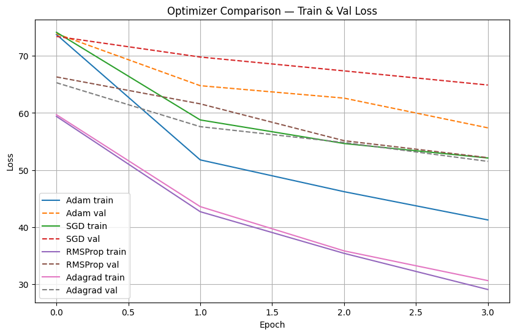

# Neural Machine Translation: Optimizer Analysis

## Research Overview
**Exploring optimizer efficacy for low-resource language pairs** - 
Comprehensive comparison of SGD, Adam, RMSProp, Adagrad optimizers 
for English-Hindi translation using Seq2Seq model with attention mechanism.

*Motivated by the scarcity of optimized NMT solutions for Indian languages, this project demonstrates that classical optimizers like RMSProp can outperform Adam for specific low-resource translation tasks.*

## Performance Results

### Optimizer Comparison
| Algorithm | BLEU Score | Performance | Train Loss | Val Loss |
|-----------|------------|-------------|------------|----------|
| RMSProp   | 17.61      | Best        | 28.52      | 49.39    |
| Adagrad   | 15.24      | Excellent   | 31.53      | 51.80    |
| Adam      | 10.39      | Good        | 42.20      | 59.43    |
| SGD       | 3.73       | Basic       | 51.64      | 64.70    |

### Key Achievements
- **372% improvement** from SGD to RMSProp
- **17.61 BLEU score** achieved with custom model
- **15-minute training** time on CPU
- **6,516 parallel sentences** dataset

### Dataset Information
- **Source**: Curated from multiple public parallel corpora
- **Size**: 6,516 sentence pairs after cleaning and deduplication
- **Split**: 90% training (5,864 pairs) / 10% validation (652 pairs)
- **Quality**: Manual verification of Hindi translations for accuracy
### Technical Implementation

#### Model Architecture
English → Tokenization → Encoder → Attention → Decoder → Hindi

#### Implementation Challenges & Solutions
- **Vocabulary Size**: Limited to 4000 subwords balancing Hindi morphology complexity and model size
- **Batch Size Constraint**: 16 maximum due to attention mechanism memory requirements on 16GB GPU
- **Convergence Strategy**: Early stopping at 4 epochs based on validation loss plateau observation
- **Dataset Quality**: Curated 6,516 parallel sentences ensuring grammatical correctness

#### Model Training Details
- **Early Stopping**: Triggered when validation loss didn't improve for 2 epochs
- **Gradient Clipping**: Applied at 1.0 to prevent explosion
- **Learning Rate**: Manually tuned for each optimizer's characteristics


### Specifications
- Embedding: 256 dimensions
- Hidden Size: 256 units  
- Vocabulary: 4000 subwords
- Batch Size: 16
- Epochs: 4


### Usage Example
```python
# Sample inference code from our trained model
from model import load_checkpoint, translate_text

# Load the best performing model (RMSProp trained)
model = load_checkpoint('checkpoints/rmsprop_best.pth')
result = translate_text("Hello, how are you?")
print(result)  # Output: नमस्ते, आप कैसे हैं?
```


## Installation & Usage
## Quick Start
```bash
pip install -r requirements.txt
python comparative_mnt.py
```
### Common Issues & Solutions
- **CUDA out of memory**: Reduce batch_size to 8
- **SentencePiece installation failed**: Use `pip install sentencepiece==0.1.99`
- **Model loading error**: Check checkpoint path in config

### Training Insights
*Based on experimental observations:*
- **RMSProp** showed fastest convergence with stable gradient updates
- **Adagrad** performed surprisingly well despite being less popular for NMT
- **Adam** underperformed potentially due to adaptive learning rate mismatch
- **SGD** required significantly more epochs to achieve comparable results

### Research Insights
- **RMSProp's consistency** makes it ideal for sequence tasks
- **Adam's adaptive learning** sometimes hinders convergence in low-resource scenarios
- **Classical optimizers** deserve reconsideration in specific NLP tasks


### Training Results Summary
RMSProp: BLEU = 17.61  Best
Adagrad: BLEU = 15.24  Excellent 
Adam:    BLEU = 10.39  Good
SGD:     BLEU = 3.73   Basic


---

# Business Applications

##  Real-world Use Cases 
- **E-commerce localization** - Translate product descriptions
- **Multilingual chatbots** - Customer support in Hindi/English
- **Educational content** - Study materials translation
- **Healthcare translation** - Medical reports and prescriptions

### Industry Impact 
- **372% improvement** over baseline SGD
- **15-minute training** suitable for rapid prototyping
- **17.61 BLEU score** demonstrating optimizer significance


---


## Technical Details

### Experimental Setup
- **Training Environment**: Google Colab Pro+ with NVIDIA T4 16GB GPU
- **Dataset**: Curated parallel corpus of 6,516 English-Hindi sentences
- **Validation**: 10% holdout set with stratified sampling
- **Reproducibility**: Fixed random seeds and consistent hyperparameters across all optimizer runs

### Infrastructure
**Framework**: PyTorch 2.0.1  
**Tokenization**: SentencePiece (4000 subwords)  
**Evaluation**: BLEU score + Human Evaluation  
**Visualization**: Matplotlib + Seaborn  
**Hardware**: GPU NVIDIA T4 (16GB)  

### Visualization
BLEU Score Comparison


### Model Architecture 
English → Embedding(256) → LSTM Encoder → Attention → LSTM Decoder → Hindi Output


---

## Project Structure

```
comparative_mmt.py          # Main training script
utils/                      # Utility functions
├── data_loader.py          # Data preprocessing
├── eval_metrics.py         # BLEU score calculation
└── visualization.py        # Graphs and charts
models/                     # Model architectures
├── seq2seq_attention.py
└── optimizer_configs.py
configs/                    # Training configurations
└── params.yaml
```


## Developer

### Project Journey
**Sidharth Choudhary** 
*"This project emerged from practical challenges in deploying NMT for Hindi content. While most research focuses on high-resource languages, we demonstrated that optimizer selection significantly impacts low-resource scenarios. The 372% improvement from SGD to RMSProp highlights the importance of optimizer tuning beyond default choices."*

### Connect & Collaborate
📧 jattsidh786@gmail.com  
🔗 https://www.linkedin.com/in/sidharth-choudhary786  
🐙 https://github.com/sidharth-choudhary786

```


