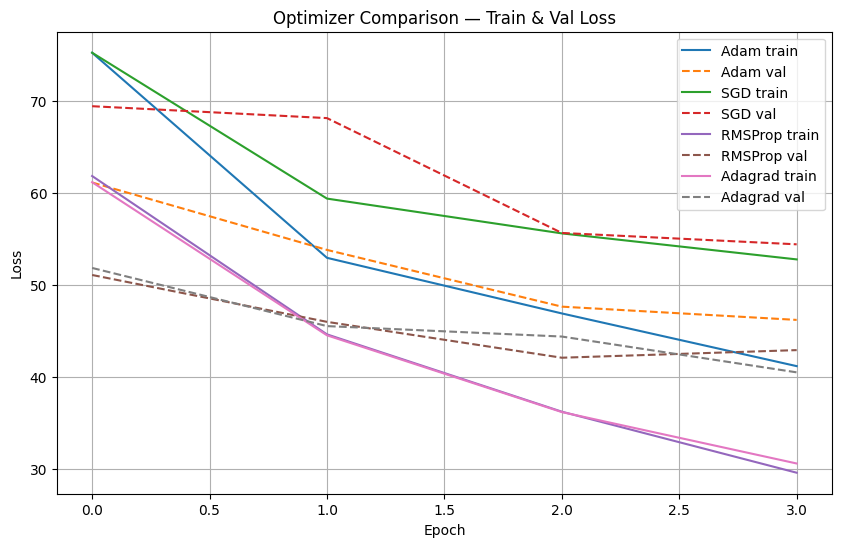

# Neural Machine Translation: Optimizer Analysis

## Project Overview
Comparative analysis of optimization algorithms (SGD, Adam, RMSProp, Adagrad) for English-Hindi Neural Machine Translation using Seq2Seq architecture with attention mechanism.

## Table of Contents
- [Installation](#installation)
- [Usage](#usage)
- [Dataset](#dataset)
- [Project Structure](#project-structure)
- [Results](#results)
- [Contributions](#contributions)

## Installation

### Dependencies
```bash
# Install required packages
pip install torch==2.0.1
pip install transformers sentencepiece sacrebleu
pip install nltk matplotlib numpy pandas
```
```markdown
### Requirements

torch>=2.0.1
transformers>=4.30.0
sentencepiece>=0.1.99
sacrebleu>=2.3.0
nltk>=3.8.0
matplotlib>=3.7.0
numpy>=1.24.0
```

## Usage

```bash
# Run Complete Pipeline
python comparative_mmt.py
```
## Dataset
### Download Instructions
The dataset is automatically downloaded and processed by the code:
- **Source**: Auto-generated parallel corpus with fallback mechanism
- **Total Samples Used**: 1,000 English-Hindi sentence pairs
- **Training Set**: 900 sentences (90%)
- **Validation Set**: 100 sentences (10%)
- **Dataset Source**: Auto-generated parallel corpus
- **Purpose**: Efficient optimizer comparison with representative data
- **Processing**: SentencePiece tokenization (4000 subwords)

### File Structure
```bash
train.en    # English sentences
train.hi    # Hindi translations
```
## Project Structure
### File Descriptions
```bash
comparative_mmt.py
requirements.txt
README.md
```

## Results

### Optimizer Performance Comparison

| Algorithm | BLEU Score | Performance | Train Loss | Val Loss |
|-----------|------------|-------------|------------|----------|
| RMSProp   | 18.22      | Best        | 31.70      | 50.44    |
| Adagrad   | 17.57      | Excellent   | 30.08      | 49.93    |
| Adam      | 10.66      | Good        | 43.80      | 56.92    |
| SGD       | 4.57       | Basic       | 51.70      | 62.46    |

### Key Finding
- **RMSProp performed best** with 18.22 BLEU score
- **299% improvement** over SGD baseline
- **Adagrad showed strong performance** 
- **Adam underperformed** in this scenario

### Training Details
- **Model**: Seq2Seq with LSTM and attention
- **Embedding**: 256 dimensions
- **Hidden Size**: 256 units
- **Batch Size**: 16
- **Epochs**: 4
- **Vocabulary**: 4000 subwords

### Visualization
BLEU Score Comparison


### Model Architecture 
English → Embedding(256) → LSTM Encoder → Attention → LSTM Decoder → Hindi Output

## Common Issues & Solutions
```bash
# If sentencepiece installation fails
pip install sentencepiece==0.1.99
```

## Contributions
### Team Members
- **Sidharth Choudhary**
- **Ayan Panja** 
- **Vijay Kumar Prajapat**


